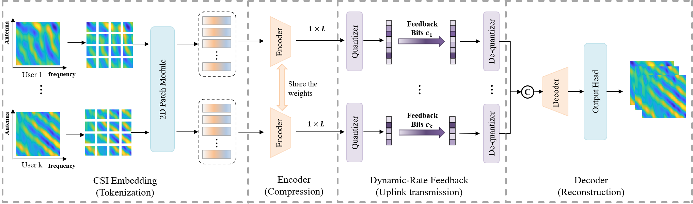

# WiFo-CF: Wireless Foundation Model for CSI Feedback
Liu, Xuanyu, et al. "WiFo-CF: Wireless Foundation Model for CSI Feedback." arXiv preprint arXiv:2508.04068 (2025). [[paper]](https://arxiv.org/pdf/2508.04068)
<br>

<p align="center">

<p>

## Overview
WiFo-CF is a wireless foundation model designed for CSI feedback under heterogeneous system configurations.  
Unlike conventional task-specific models that are usually trained for a fixed antenna setting, feedback rate, or channel distribution, WiFo-CF aims to provide a unified framework that can generalize across diverse CSI dimensions, user configurations, feedback bit-widths, and deployment scenarios.

To achieve this, WiFo-CF combines:
- a **multi-user, multi-rate self-supervised pre-training strategy**,
- a flexible **multi-user scalable autoencoder (MUAE)** architecture,
- and a **Mixture of Shared and Routed Experts (S-R MoE)** design for modeling both shared channel correlations and dataset-specific characteristics.

## Pre-training Dataset
We build **LH-CDF**, a large-scale heterogeneous CSI feedback dataset for foundation-model pre-training.

LH-CDF includes:
- **Statistical-modeling-based data** generated by QuaDriGa,
- **Ray-tracing-based data** from DeepMIMO and SynthSoM,
- **Real-world measured data** from Argos and Dichasus.

The dataset covers diverse:
- carrier frequencies,
- antenna configurations,
- user numbers,
- propagation scenarios,
- and channel distributions.

This heterogeneous design enables WiFo-CF to learn more generalizable channel representations for CSI compression and reconstruction.


## Dependencies and Installation
- Python 3.8 (Recommend to use [Anaconda](https://www.anaconda.com/))
- Pytorch 2.0.0
- NVIDIA GPU + CUDA
- Python packages: `pip install -r requirements.txt`


### Evaluation

After installing the dependencies, download the LH-CDF test dataset and pretrained checkpoint:

- Test dataset: [LH-CDF](https://huggingface.co/datasets/PPASS/LH-CDF/tree/main/LH-CDF)
- Pretrained checkpoint: [wifo_cf_base.pth](https://huggingface.co/datasets/PPASS/LH-CDF/blob/main/wifo_cf_base.pth)

Place the `LH-CDF` dataset under `./dataset/`, or use your own channel data with the same data structure. WiFo-CF supports channel compression and reconstruction with arbitrary numbers of antennas and subcarriers.

Put `wifo_cf_base.pth` in the project root directory, then run:

```bash
bash test.sh
python get_result.py
```
`test.sh` runs the evaluation, and `get_result.py` summarizes the final results.

## Current Status
At this stage, we have released:
- [x] Model architecture code
- [x] Testing / inference code
- [x] Pretrained model weights
- [x] Pretraining dataset

## TODO
The following components will be released progressively:
- [ ] Fine-tuning code for downstream tasks
- [ ] Training scripts
- [ ] More comprehensive documentation

## Notes
This repository is actively maintained.  
We will progressively release additional resources to facilitate reproducibility and follow-up research, including pretrained checkpoints, pretraining datasets, and downstream fine-tuning pipelines.
